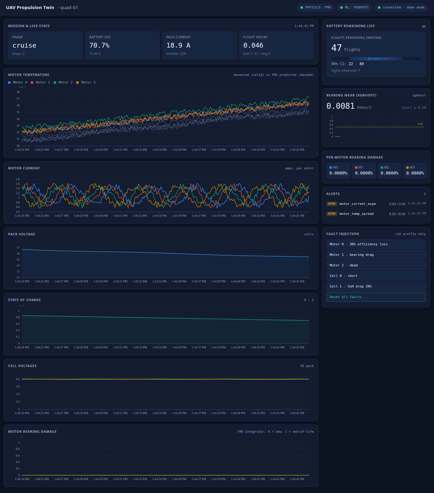

# UAV Propulsion Digital Twin

Open-source, end-to-end digital twin for a small electric multirotor. Runs
entirely on your laptop in Docker; no drone, no cloud account, no paid tools.
Fuses **OpenModelica physics** (battery equivalent circuit, motor thermal,
bearing damage), a **trained XGBoost classifier** for motor bearing wear, and
a **Gaussian process** for battery remaining-useful-life — behind a live MQTT
bus and a first-party HTML dashboard.

**[▶ Live demo](https://moulanamore.github.io/uav-twin/)** — the dashboard
with synthesised telemetry, running in your browser, no clone or Docker
required.

[](https://moulanamore.github.io/uav-twin/)

*Live dashboard with the twin running against ArduPilot SITL: measured motor
temperatures (solid) tracked against FMU prediction (dashed), 90% credible
interval on the GP battery RUL forecast, XGBoost bearing wear scored every
2 seconds against a fixed operational threshold, and physics-derived per-motor
damage integrator.*

**License**: Apache-2.0. **Status**: Phase 3c complete
([details](docs/phase-3c-complete.md)). All third-party dependencies keep at
process boundaries; nothing GPL is linked into any of our code.

---

## Quickstart

**Prereqs**: Docker Desktop (Win / macOS) or Docker Engine + Compose plugin
(Linux). ~2 GB free RAM for the running stack; ~4 GB additional peak during
the first SITL build; a modern browser.

**One command up** (real ArduPilot SITL + FMU + XGBoost + GP):

```bash
docker compose --profile sitl up --build
```

First build takes ~15 min (ArduPilot is compiled from source, cached
afterwards). Once running, open **http://localhost:8080** and you'll see the
dashboard above filling in as the vehicle cycles the demo mission.

**Faster path — Python simulator** (no ArduPilot build, first launch ~90 s):

```bash
docker compose --profile sim up --build
```

Same dashboard, same MQTT topics, same worker; only the telemetry source
differs. This mode also honors the fault-injection buttons in the dashboard.

**Dashboard preview without Docker** — open `dashboard/index.html?demo=1`
directly in a browser to see the layout populated with synthesised data.

Stop with `Ctrl-C`; tear down with `docker compose --profile <name> down`.
Wipe historian volumes with `docker compose down -v`.

---

## What's inside

Six containers orchestrated by Docker Compose:

| Service | Purpose |
|---|---|
| `mosquitto` | MQTT broker (Eclipse Mosquitto 2) |
| `influxdb` | Time-series historian (InfluxDB 2 OSS) |
| `worker` | FMU physics + XGBoost + GP fusion (Python 3.12) |
| `dashboard` | Static browser dashboard (nginx serving one HTML file) |
| `sitl` | ArduPilot ArduCopter, pinned tag `Copter-4.5.7` |
| `mavlink-bridge` | MAVLink → MQTT translator with force-arm mission loop |

The worker runs three engines on every telemetry tick (10 Hz):

1. **OpenModelica FMU** (`worker/models/UAVPropulsion.fmu`, compiled by
   `omc` during Docker build) integrates battery SoC/SoH, per-motor thermal
   state, per-motor bearing damage.
2. **XGBoost bearing-wear classifier** (`worker/models/bearing_wear.pkl`,
   trained in notebook 04 with CV AUC 0.9998) scores a 28-feature rolling
   2-second window and publishes `p_fault` + alert.
3. **Gaussian process battery RUL** (`worker/models/battery_rul.pkl`, trained
   in notebook 05 with 90% coverage 92.4%) reads per-flight snapshots and
   publishes median + 5th/95th percentile flights remaining.

If either ML model fails to load, the worker logs it and continues serving
the FMU state — same graceful fallback if the FMU itself is missing.

MQTT topic map (under `uav/<uav-id>/`):

| Topic | Publisher | Rate | Payload |
|---|---|---|---|
| `telemetry/state` | bridge / sim | 10 Hz | Battery, per-motor, phase, throttle |
| `twin/state` | worker | 10 Hz | FMU state: SoC, SoH, motor temps, damage |
| `twin/anomaly` | worker | 0.5 Hz | XGBoost p_fault, alert bool |
| `twin/rul` | worker | 0.033 Hz | GP RUL median + 90% CI |
| `twin/alerts` | worker | on trigger | Discrete threshold events |
| `fault/inject` | dashboard | on click | Fault-injection command (sim only) |

Full payload schemas: [`docs/phase-3c-complete.md`](docs/phase-3c-complete.md).

---

## Architecture

```
                  ┌────────────────────────────────┐
                  │      Browser dashboard         │
                  │      ECharts + MQTT.js         │
                  └───────────────┬────────────────┘
                                  │ ws://:9001
                          ┌───────▼────────┐
                          │   Mosquitto    │
                          │   MQTT broker  │
                          └─┬────┬─────┬───┘
                            │    │     │
       ┌────────────────────┘    │     └────────────────────┐
       │                         │                          │
  telemetry/state          twin/state, /anomaly,      fault/inject
       │                    /rul, /alerts                   │
   ┌───┴────┐              ┌────┴────────────────┐          │
   │Python  │              │      Worker         │          │
   │  sim   │(sim mode)    │  ┌─────────────┐    │          │
   └────────┘              │  │ fmu_runner  │◄───┼──── FMU physics
                           │  ├─────────────┤    │
   ┌────────┐              │  │ ml_runner   │◄───┼──── XGBoost, GP
   │ SITL   │              │  └─────────────┘    │
   │(sitl)  │              └────┬────────────────┘
   └───┬────┘                   │
       │ tcp:5760               │
   ┌───▼─────────┐              ▼
   │ MAVLink     │        ┌──────────┐
   │   bridge    │        │ InfluxDB │
   └─────────────┘        │ historian│
                          └──────────┘
```

The pattern: **one telemetry schema, pluggable sources, additive worker
layers**. The worker didn't change when the simulator was replaced by real
ArduPilot; the dashboard didn't change when the FMU replaced pure Python; the
worker only *added* code (didn't modify existing) when XGBoost + GP were
wired in. That constraint is intentional — the same discipline that lets you
swap SITL for a real UAV in Phase 4 without rewriting anything upstream.

---

## Repo layout

```
uav-twin/
├── docker-compose.yml            profiles: sim (Phase 1a), sitl (1b onwards)
├── LICENSE                       Apache-2.0
├── README.md                     this file
├── dashboard/
│   ├── index.html                the whole UI (one file, dark theme, demo mode)
│   └── vendor/                   ECharts + MQTT.js, vendored — no CDN
├── docs/
│   ├── technical-overview.md     concept + architecture (also .pdf)
│   ├── phase-3a-study-guide.md   ML layer walkthrough (also .pdf)
│   ├── phase-3c-complete.md      operational reference (also .pdf)
│   └── dashboard-hero.png        the screenshot at the top of this README
├── mavlink-bridge/               MAVLink → MQTT translator + mission loop
├── mosquitto/config/
├── notebooks/
│   ├── 01_ims_bearing_exploration.ipynb    bearing wear shape (NASA IMS)
│   ├── 02_alfa_fault_flights.ipynb         UAV fault shape (CMU ALFA)
│   ├── 03_nasa_battery_aging.ipynb         Li-ion capacity fade (NASA PCoE)
│   ├── 04_model_a_xgboost.ipynb            train XGBoost → bearing_wear.pkl
│   ├── 05_model_b_gp.ipynb                 train GP     → battery_rul.pkl
│   ├── 06_worker_integration.ipynb         end-to-end integration test
│   ├── utils/                              synthetic-fallback data loaders
│   └── requirements.txt
├── simulator/                    Phase 1a Python quadrotor
├── sitl/                         ArduPilot SITL Docker build
└── worker/
    ├── twin_worker.py            MQTT / Influx / FMU / ML orchestrator
    ├── fmu_runner.py             OpenModelica FMU wrapper (Python fallback)
    ├── ml_runner.py              XGBoost + GP loader
    ├── requirements.txt
    └── models/
        ├── UAVPropulsion.mo      Modelica source (compiled at build time)
        ├── UAVPropulsion.fmu     compiled FMU (checked in for reproducibility)
        ├── bearing_wear.pkl      XGBoost trained model
        ├── bearing_wear.json     model contract: features, threshold, CV
        ├── battery_rul.pkl       GP + scaler bundle
        └── battery_rul.json      model contract: features, kernel, CV
```

---

## Data sources & training

The three notebooks 01/02/03 each work against a permissively-licensed public
dataset AND ship a synthetic fallback loader with the same feature
distributions. That means every notebook runs end-to-end on a fresh clone
with no downloads, and swapping to real data is a one-liner (env var
pointing at the download folder).

| Dataset | Size | License | Origin |
|---|---|---|---|
| [NASA IMS bearings](https://www.kaggle.com/datasets/vinayak123tyagi/bearing-dataset) | ~1 GB | CC0 | Univ. Cincinnati IMS Center, via NASA PCoE |
| [ALFA UAV faults](https://github.com/castacks/alfa-dataset) | ~2 GB | CC-BY | Carnegie Mellon AirLab |
| [NASA Li-ion aging](https://data.nasa.gov/dataset/li-ion-battery-aging-datasets) | ~500 MB | Public domain | NASA PCoE |

Trained-model metrics (on synthetic fallback, verified in notebooks):
XGBoost bearing wear CV AUC 0.9998 (std 0.00019); GP battery RUL 90% coverage
92.4%, RMSE 46.5 flights. Real fleet data will re-train identically — the
pipeline stays the same; only the parquet under it changes.

Notebook walkthrough: [`docs/phase-3a-study-guide.md`](docs/phase-3a-study-guide.md).

---

## Roadmap

- **Phase 0** — think-tank scope, tooling decisions ✓
- **Phase 1a** — Python simulator + Python analytical twin + dashboard ✓
- **Phase 1b** — ArduPilot SITL + MAVLink bridge ✓
- **Phase 1c** — OpenModelica FMU replacing Python analytics ✓
- **Phase 2** — Requirements gathering as an operator survey ✓
- **Phase 3a** — Data exploration + XGBoost bearing classifier ✓
- **Phase 3b** — Gaussian process battery RUL ✓
- **Phase 3c** — Worker integration, end-to-end verification ✓ *(you are here)*
- **Phase 4** — Real research quadrotor; MAVLink from a real airframe replacing SITL
- **Phase 5** — Hosted app for first paying operator customer

Details, exit criteria, and known limitations for each phase:
[`docs/technical-overview.md`](docs/technical-overview.md).

---

## Configuration

Tune anything by editing the `environment:` block of the relevant service in
`docker-compose.yml`. The full list is in
[`docs/phase-3c-complete.md`](docs/phase-3c-complete.md); the ones most
worth knowing about:

| Variable | Default | Purpose |
|---|---|---|
| `UAV_ID` | `quad-01` | Vehicle identifier in every MQTT topic |
| `SITL_HOME_LAT` / `_LON` | Chennai (13.0827, 80.2707) | Simulated home position |
| `SITL_SPEEDUP` | `1` | ArduPilot sim speed multiplier |
| `MOTOR_KV` / `MOTOR_ETA` | 900 / 0.85 | Motor constants for RPM synthesis in the bridge |
| `TICK_HZ` | `10` | Telemetry publish rate |

The default InfluxDB credentials (`admin` / `uavtwin-dev`, token
`uavtwin-dev-token`) are dev-only sane defaults; regenerate them before any
non-local deployment.

---

## Troubleshooting

**`docker compose --profile sitl up --build` takes forever** — expected on
first run. Building ArduCopter from source is ~15 min; the Modelica FMU
compile stage adds another minute or two. Both cached afterwards.

**Motors show 0 RPM in Phase 1b** — SITL's motor model is thrust-only and
doesn't populate `ESC_TELEMETRY_1_TO_4.rpm`. The bridge synthesizes RPM from
`throttle × V_pack × MOTOR_KV × MOTOR_ETA` when armed; on the ground it
correctly reads 0.

**"waiting for SITL heartbeat …" never resolves** — SITL didn't start. Tail
`docker compose logs sitl`; most commonly the ArduPilot build failed.

**Battery low-capacity failsafe blocks arming after a long test run** —
disable the mAh failsafes in `sitl/defaults.parm` (`BATT_LOW_MAH`,
`BATT_CRT_MAH`, `BATT_ARM_MAH` = 0); already off in the default config.

**Twin/rul says "warming up" for the first 14 min** — the GP needs ~5 Ah of
pack throughput before it has enough per-flight snapshots to predict. Real
behaviour; not a bug.

**Dashboard shows old data / doesn't update** — check the MQTT pill in the
header. If it says "disconnected", the browser can't reach ws://localhost:9001.
Compose profile mismatched, or nginx / mosquitto stopped.

---

## License notes

This project: **Apache-2.0**.

Third-party runtime components run at process boundaries (separate
containers, socket protocols) so none of their licenses reach our code:

- Eclipse Mosquitto — EPL-2.0 / EDL-1.0
- InfluxDB OSS 2.x — MIT
- nginx — 2-clause BSD
- ArduPilot / ArduCopter — GPLv3 (network boundary; never linked)
- OpenModelica — GPL / OSMC-PL (compile-time only, produces FMU we own)
- pymavlink — LGPL
- paho-mqtt — EPL-2.0 / EDL-1.0
- influxdb-client (Python) — MIT
- numpy — BSD-3
- xgboost — Apache-2.0
- scikit-learn — BSD-3
- fmpy — BSD-2

Bundled (vendored) into the dashboard:

- [Apache ECharts](https://echarts.apache.org) — Apache-2.0
- [MQTT.js](https://github.com/mqttjs/MQTT.js) — MIT

We deliberately do NOT bundle Grafana (AGPL-3.0). The dashboard is a
first-party HTML page with vendored charting.

---

## Credits

Built by [Asick Jahir](https://github.com/) — aeronautical engineer,
Chennai — with substantial coauthoring from Claude (Anthropic). Prior art
that shaped the design: Rolls-Royce IntelligentEngine, the AIAA digital
twin paradigm review, ISO 23247. Datasets from NASA PCoE and Carnegie
Mellon AirLab.
